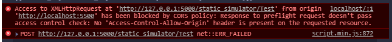

# virtual-circuits-lab
The **backend** of the web-based virtual circuits lab.  
It is built using `Python` with `Flask`.  
Please refer to our **frontend** at [circuit-simulator-frontend](https://github.com/YukaiZhang2019/circuit-simulator-frontend).

## To Install Required Packages
#### For PySpice Only
1. PyCharm:  
    *settings -> project -> Python Interpreter:*  
        *install:* `PySpice`
2. Run the following on command line:
```
pyspice-post-installation --install-ngspice-dll
pyspice-post-installation --check-install
```

## If You Run into issues with the above, follow the below steps instead
1. Install Python 3.7. Make sure you add all the necessary filepaths to your environment variables.
2. Install pipenv using the command `pip install pipenv`
3. Download PyCharm IDE and select open project and pick the virtual-circuits-lab directory on your machine
4. Go to Settings -> Project: virtual-circuits-lab -> Python Interpreter then select the settings icon -> Add -> Pipenv Environment. PyCharm will automatically detect the filepath of the pipenv executable file. Approve of the interpreter. 
5. PyCharm should automatically start to install all the project dependencies. Once it is done, exit the settings popup. If PyCharm does not intall all dependencies, run the following command from the PyCharm terminal: `pipenv install`
6. Now, run `pyspice-post-installation --install-ngspice-dll`. Observe the following error message: 
7. Follow the url displayed: https://sourceforge.net/projects/ngspice/files/ng-spice-rework/old-releases/32/ and download the file titled: ngspice-32_dll_64.zip
8.  Run `pyspice-post-installation --check-install` and observe at the end of the terminal message, the following filepath being checked for ngspice dll: 
9.  Extract the zip file from step 7, and then move the extracted directory called Spice64_dll to the appropriate folder according to the filepath you observe in step 8. 
10. Navigate to the Spice64_dll/dll-vs/ directory from there and notice that your filename inside it is called: ngspice-32.dll. Rename it to match the filename in the filepath of step 8. 
11. Now, click the run button in PyCharm to run app.py. It should run. 

## Dealing with CORS Issue:
CORS issue dealt with: 



Used Flask extension `flask-cors` to handle Cross Origin Resource Sharing (CORS) issue. Extension is added as dependency in the Pipfile - it should be installed when running the command `pipenv install` the first time to install all project dependencies in the virtual environment. Otherwise, re-run the command `pipenv install` after pulling this file in the virtual environment to update Pipfile.lock and resolve dependecies for project.

## To Run
Run `app.py`.  
For other steps, please refer to the instructions in our [frontend repository](https://github.com/YukaiZhang2019/circuit-simulator-frontend).

## To Test
Use [Postman](https://www.postman.com/) to send HTTP Requests and receive HTTP Responses.

## PySpice Documentation
Please refer to [PySpice](https://github.com/FabriceSalvaire/PySpice).

## Acknowledgement
Aside from the SPICE functions, this backend code structure is built based on a template we studied in a public online course on Udemy, provided by Jose Salvatierra of Teclado
The course can be found here:  
[REST APIs with Flask and Python](https://www.udemy.com/share/1026WUAEAaeFlTQnkF/)  
[Advanced REST APIs with Flask and Python](https://www.udemy.com/share/101sjYAEAaeFlTQnkF/)

---

## Note for Programmers
All files marked as `template` is for setting up the *authorization levels* (built upon the template from the previous section (i.e., Acknowledgement).  
For circuit simulation, please refer to `simulate.py`, for the web application, please refer to `app.py`.

### Implemented Circuit Elements
1. DC Voltage Source
2. DC Current Source
3. Sinusoidal Voltage Source
4. Sinusoidal Current Source
5. Resistor
6. Capacitor
7. Inductor
8. Voltmeter
9. Ammeter
10. Diode
11. BJT (NPN, PNP)
12. MOSFET (NMOS, PMOS)
